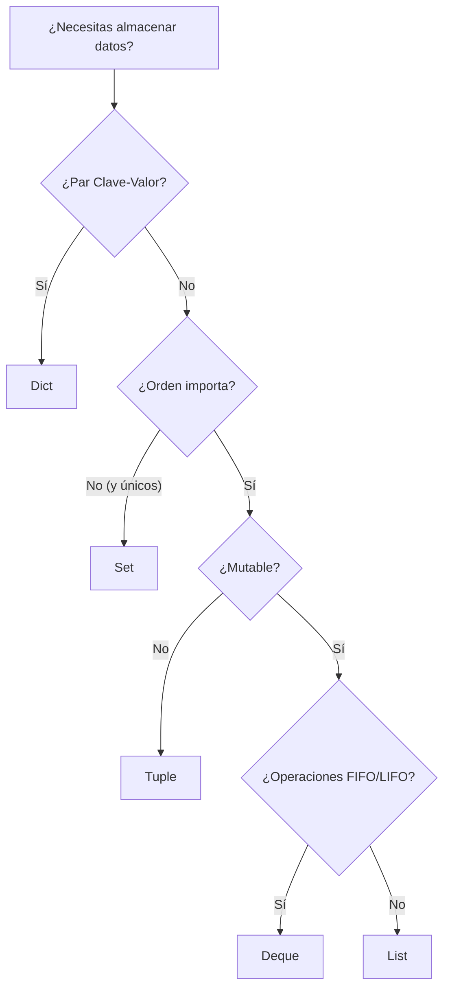

# 🏗️ Estructuras de Datos en Python: Más allá de lo básico

## 1. Introducción
Una de las diferencias entre un programador junior y uno experto es el conocimiento profundo de las estructuras de datos. No se trata solo de saber que existen, sino de entender **cómo se implementan en memoria** y **cuál es su complejidad temporal (Big O)** para operaciones comunes.

## 2. Las 4 Grandes: List, Tuple, Set, Dict

### 2.1 📋 Listas (List)
- **Implementación**: Arreglos dinámicos (referencias contiguas en memoria).
- **Características**: Mutable, ordenada, permite duplicados.
- **Complejidad**:
    - Acceso por índice: O(1)
    - Append: O(1) amortizado
    - Insert/Delete (al inicio/medio): O(n) (debe desplazar elementos)
    - Búsqueda (`x in list`): O(n)

> [!CAUTION]
> Si necesitas una cola (FIFO), **NO** uses `list.pop(0)` ya que es O(n). Usa `collections.deque`.

### 2.2 🔒 Tuplas (Tuple)
- **Implementación**: Similar a listas pero estáticas (inmutables).
- **Ventajas**: Menor "overhead" de memoria que las listas. Son "hashable" (pueden ser claves de diccionarios).
- **Uso**: Datos que no deben cambiar (coordenadas, registros de BD).

### 2.3 ⚡ Conjuntos (Set)
- **Implementación**: Tabla Hash (sin valores).
- **Características**: Mutable, desordenada, **ELEMENTOS ÚNICOS**.
- **Complejidad**:
    - Insertar/Eliminar: O(1) promedio.
    - Búsqueda (`x in set`): O(1) promedio.
    - Operaciones de conjuntos (Unión, Intersección): O(len(s) + len(t)).

> [!TIP]
> **Cuándo usar Set**:
> 1. Eliminar duplicados de una lista: `list(set(mi_lista))`
> 2. Pertenencia rápida: Verificar si un ID existe es O(1) vs O(n) en listas.

### 2.4 🔑 Diccionarios (Dict)
- **Implementación**: Tabla Hash optimizada.
- **Características**: Clave-Valor. Claves deben ser hashables. Desde Python 3.7+ mantienen orden de inserción.
- **Complejidad**:
    - Acceso/Asignación: O(1) promedio.

## 3. 🛠️ Módulo `collections`: Las herramientas ocultas

### `deque` (Double-ended queue)
Optimized list for appending and popping from both ends. O(1) for pop(0).

### `defaultdict`
Evita el `KeyError`. Si la clave no existe, ejecuta una función fábrica para crearla.

### `Counter`
Especializado en contar elementos hashables.

### `namedtuple`
Crea tuplas con nombres de campos. Mejora la legibilidad (self-documenting code) sin el peso de una clase completa.

## 4. 🧠 Diagrama de Decisión

---
[🏠 Volver al Inicio](../../README.md) | [Siguiente: Programación Funcional ➡️](../02_Programacion_Funcional/02_guia_funcional.md)
