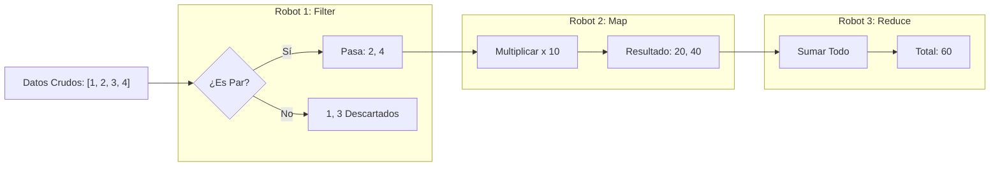

# 🏭 Programación Funcional: La Fábrica de Juguetes


## 👶 1. Explicación para Niños (ELI5)

Imagina una fábrica de autos.
1.  Entra una pieza de metal.
2.  Un robot la aplasta (**Map**).
3.  Otro robot revisa si está rota (**Filter**).
4.  Al final se juntan todas las piezas (**Reduce**).

En Python, tus datos son las piezas de metal y las "Funciones" son los robots.
Lo genial es que **los robots no guardan las piezas**, solo las pasan al siguiente.

---

## 🔬 2. Deep Dive: Inmutabilidad y Funciones Puras

### ¿Por qué molestarse?
La programación orientada a objetos (POO) guarda "Estado" (`self.x = 5`). Eso es peligroso. Si dos hilos tocan `self.x` a la vez... ¡BOOM!
La Programación Funcional es **Inmutable**.
- No cambias la lista original.
- Creas una **NUEVA** lista transformada.
- **Ventaja**: Cero bugs de concurrencia. Código más fácil de testear.

---

## 📊 3. Visualización: El Pipeline de Datos



---

## 👩‍💻 4. Tutorial Interactivo: Procesando Usuarios

Vamos a procesar una lista de usuarios "sucios" (diccionarios con datos) para obtener un reporte limpio.

```python
from functools import reduce

# 1. DATOS DE ENTRADA (Materia Prima)
usuarios = [
    {"nombre": "Ana", "edad": 25, "rol": "admin"},
    {"nombre": "Bob", "edad": 17, "rol": "user"},  # Menor de edad
    {"nombre": "Carlos", "edad": 30, "rol": "user"},
    {"nombre": "Diana", "edad": 19, "rol": "admin"},
]

# 2. DEFINIR LOS ROBOTS (Funciones puras)
es_adulto = lambda u: u["edad"] >= 18
obtener_nombre = lambda u: u["nombre"].upper()

print("--- Paso 1: Filtrar (Filter) ---")
# filter devuelve un iterador, usamos list() para verlo
adultos = list(filter(es_adulto, usuarios))
print(f"Adultos detectados: {len(adultos)} usuarios")
# [Ana, Carlos, Diana] (Bob fue descartado)

print("\n--- Paso 2: Transformar (Map) ---")
nombres_mayuscula = list(map(obtener_nombre, adultos))
print(f"Nombres procesados: {nombres_mayuscula}")
# ['ANA', 'CARLOS', 'DIANA']

print("\n--- Paso 3: Agregar (Reduce) ---")
# Queremos sumar todas las edades de los adultos
# reduce(funcion, iterable, valor_inicial)
suma_edades = reduce(lambda acumulador, u: acumulador + u["edad"], adultos, 0)
print(f"Suma de edades de adultos: {suma_edades}")
# 25 + 30 + 19 = 74

print("\n--- ⚡ PRO TIP: List Comprehensions ---")
# Todo lo anterior se puede hacer en una línea "Pythonica"
# [TRANSFORMACION for ITEM in LISTA if FILTRO]
reporte_rapido = [u["nombre"].upper() for u in usuarios if u["edad"] >= 18]
print(f"Reporte one-liner: {reporte_rapido}")
```

### 🧠 ¿Qué aprendimos?
1.  **Legibilidad**: `filter` y `map` dicen explícitamente qué hacen.
2.  **Composición**: Conectamos la salida de uno a la entrada de otro.
3.  **One-Liner (Comprehension)**: En Python, a menudo preferimos las `comprehensions` porque se leen como inglés: *"Haz esto PARA cada usuario SI es adulto"*.

---
[⬅️ Anterior: Mochila Mágica](../01_Estructuras_de_Datos/01_guia_estructuras.md) | [Siguiente: Planos Maestros ➡️](../03_POO/03_guia_poo.md)
