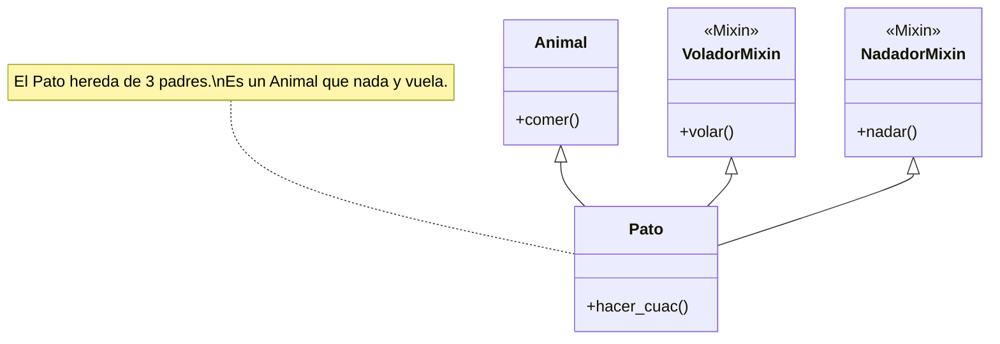

# 🏗️ POO Avanzada: El Plano Maestro


## 👶 1. Explicación para Niños (ELI5)

Imagina que eres un arquitecto.
- **Clase (`class`)**: Es el **PLANO**. Dibujas una casa en un papel. No puedes vivir en el papel.
- **Objeto (`instance`)**: Es la **CASA REAL**. Usas el plano para construir 100 casas iguales en la calle.

---

## 🔬 2. Deep Dive: MRO y Mixins

### Method Resolution Order (MRO)
Cuando usas herencia múltiple (una clase con múltiples padres), ¿a quién hace caso Python?
Python usa un algoritmo llamado **C3 Linearization**.
Si tienes `class D(B, C)`, Python busca métodos en:
1.  `D` (Hijo)
2.  `B` (Primer Padre)
3.  `C` (Segundo Padre)
4.  `object` (El abuelo de todos)

### Mixins
Son clases que **no** están hechas para instanciarse solas. Son "paquetes de habilidades" que le pegas a otras clases.
Evitan la "Herencia Diamante" compleja.

---

## 📊 3. Visualización: El Árbol Genealógico



---

## 👩‍💻 4. Tutorial Interactivo: Construyendo Productos Inteligentes

No solo vamos a crear clases, vamos a usar **métodos mágicos** para que parezcan tipos de datos nativos.

```python
# 1. EL MIXIN (Habilidad reutilizable)
class JsonMixin:
    """Clase auxiliar que permite a cualquier objeto convertirse en diccionario."""
    def to_dict(self):
        # vars(self) accede a los atributos internos del objeto
        return vars(self)

# 2. LA CLASE PRINCIPAL
class Producto(JsonMixin): # Heredamos la habilidad to_dict
    
    def __init__(self, nombre, precio):
        self._nombre = nombre
        # Usamos guion bajo para indicar "Privado" (convención)
        self._precio = precio 

    # --- HACKING DEL LENGUAJE (DUNDER METHODS) ---

    # Permite imprimir bonito: print(producto)
    def __str__(self):
        return f"📦 {self._nombre} (${self._precio})"

    # Permite sumar productos: p1 + p2
    def __add__(self, otro):
        if isinstance(otro, Producto):
            return self._precio + otro._precio
        return NotImplemented

    # --- ENCAPSULAMIENTO (PROPERTIES) ---
    
    @property
    def precio(self):
        """Getter: Permite leer .precio"""
        return self._precio
    
    @precio.setter
    def precio(self, valor):
        """Setter: Valida antes de asignar"""
        if valor < 0:
            print(f"🚨 ERROR: ¡No puedes poner precio negativo a {self._nombre}!")
            return # Rechazamos el cambio
        self._precio = valor

# 3. ZONA DE PRUEBAS
p1 = Producto("Laptop", 1000)
p2 = Producto("Mouse", 50)

print(f"1. Visualización bonita: {p1}") 
# Salida: 📦 Laptop ($1000)

print(f"2. Suma mágica: {p1 + p2}") 
# Salida: 1050 (Python usó __add__ automáticamente)

print("3. Probando seguridad del Setter...")
p1.precio = -500 # El guardia lo detiene
print(f"Precio actual: {p1.precio}") # Sigue siendo 1000

print(f"4. Probando Mixin: {p1.to_dict()}")
# {'_nombre': 'Laptop', '_precio': 1000}
```

### 🧠 ¿Qué aprendimos?
1.  **Dunder Methods (`__add__`)**: Hicimos que nuestros objetos interactúen con operadores matemáticos (`+`).
2.  **Properties**: Protegimos el atributo precio sin obligar al usuario a usar funciones feas como `set_precio(50)`. Para el usuario parece una variable normal `p.precio = 50`.
3.  **Mixins**: `JsonMixin` puede ser reutilizado en `Usuario`, `Pedido`, etc. Code Reuse FTW!

---
[⬅️ Anterior: Fábrica](../02_Programacion_Funcional/02_guia_funcional.md) | [Siguiente: Regalos ➡️](../04_Decoradores_Generadores/04_guia_deco_gen.md)
