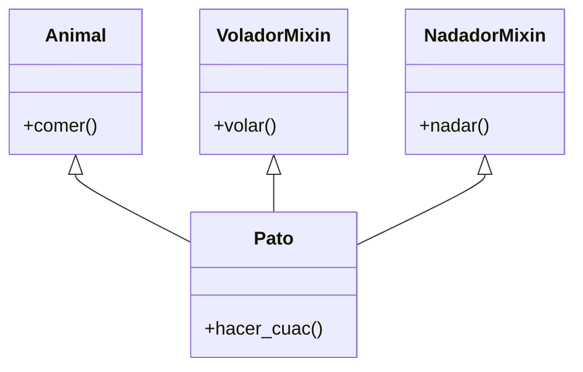

# Programación Orientada a Objetos (POO) Avanzada

## 1. Más allá de `class Perro(Animal)`
Un experto en Python no solo usa herencia, sino que domina la composición, los mixins y los "Métodos Mágicos" (Dunder Methods) para hacer que sus objetos se comporten como tipos nativos.

## 2. Herramientas Clave

### 2.1 Dunder Methods (Double Underscore)
Permiten sobrecargar operadores y definir comportamientos de bajo nivel.
- `__init__`: Constructor.
- `__str__` vs `__repr__`: `__str__` es para usuarios finales (print), `__repr__` es para desarrolladores (debugging).
- `__call__`: Permite que una instancia se comporte como una función.
- `__len__`, `__getitem__`: Para que el objeto se comporte como una lista/colección.
- `__enter__`, `__exit__`: Para Context Managers (`with statement`).

### 2.2 Mixins
Clases pequeñas diseñadas para agregar funcionalidad específica a otras clases mediante herencia múltiple, sin ser la clase "padre" principal.
> **Ejemplo**: `JsonSerializableMixin` que agrega un método `.to_json()` a cualquier clase.

### 2.3 Properties (`@property`)
Permiten encapsulamiento (getters/setters) sin cambiar la API pública de la clase. Puedes acceder a `obj.precio` pero internamente ejecutar lógica.

## 3. Diagrama: Herencia y Mixins

