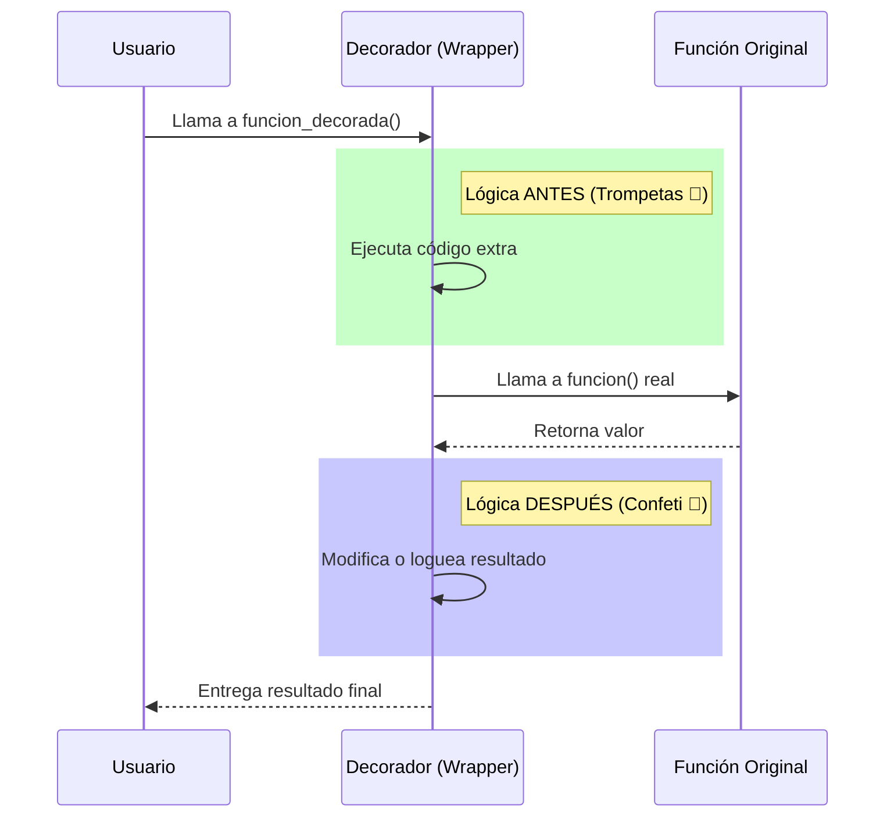

# 🎁 Decoradores: El Papel de Regalo


## 👶 1. Explicación para Niños (ELI5)

Imagina que tienes un regalo (una función).
El regalo hace algo aburrido, como decir "Hola".
Pero tú quieres que antes de decir "Hola", suenen trompetas 🎺 y después lance confeti 🎉.

En lugar de abrir el regalo y cambiarlo por dentro, lo envuelves en un **Papel de Regalo Mágico** (Decorador).
Ahora, cuando entregas el regalo, el papel hace el show de las trompetas, se abre el regalo ("Hola"), y luego el papel lanza el confeti.

---

## 🔬 2. Deep Dive: Clorures (Clausuras)

Un decorador funciona gracias a un concepto avanzado: **Closures**.
Una función *dentro* de otra función puede "recordar" las variables de su padre, incluso después de que el padre haya terminado de ejecutarse.

El decorador toma la función original (`func`), crea una función nueva (`wrapper`) que guarda a `func` en su memoria, y devuelve `wrapper`.

---

## 📊 3. Visualización: La Intercepción



---

## 👩‍💻 4. Tutorial Interactivo: Midiendo el Tiempo

Vamos a crear un decorador que mide cuánto tarda cualquier función en ejecutarse.

```python
import time
import functools

# 1. EL DECORADOR (La Fábrica de Papel de Regalo)
def cronometro(func_original):
    """Mide tiempo de ejecución de cualquier función."""
    
    # @wraps copia el nombre y docstring de la original al wrapper
    # Si no lo usas, tu función perderá su identidad
    @functools.wraps(func_original) 
    def wrapper(*args, **kwargs):
        print(f"⏱️ Iniciando cronómetro para: {func_original.__name__}")
        ingreso = time.time()
        
        # --- AQUÍ ABRIMOS EL REGALO ---
        resultado = func_original(*args, **kwargs)
        # ------------------------------
        
        salida = time.time()
        duracion = salida - ingreso
        print(f"🏁 Terminó en {duracion:.4f} segundos")
        
        return resultado # No olvides devolver lo que la función original calculó
    
    return wrapper

# 2. APLICANDO EL DECORADOR
@cronometro
def operacion_lenta(n):
    """Suma números al cuadrado."""
    print("   ...Trabajando duro...")
    return sum(x**2 for x in range(n))

# 3. PRUEBA
# Al llamar a operacion_lenta, en realidad estamos llamando a 'wrapper'
valor = operacion_lenta(1_000_000)
print(f"Resultado final: {valor}")
```

### 🧠 ¿Qué aprendimos?
1.  **Sintaxis `@`**: `@cronometro` es azúcar sintáctica para `operacion_lenta = cronometro(operacion_lenta)`.
2.  **`*args, **kwargs`**: Permite que el decorador funcione con funciones que tengan cualquier número de argumentos. Es un "comodín" universal.
3.  **Transparencia**: Gracias a `functools.wraps`, la función sigue llamándose `operacion_lenta` y no `wrapper`.

---
[⬅️ Anterior: Planos Maestros](../03_POO/03_guia_poo.md) | [Siguiente: La Red de Seguridad ➡️](../05_Manejo_Errores/05_guia_errores.md)
