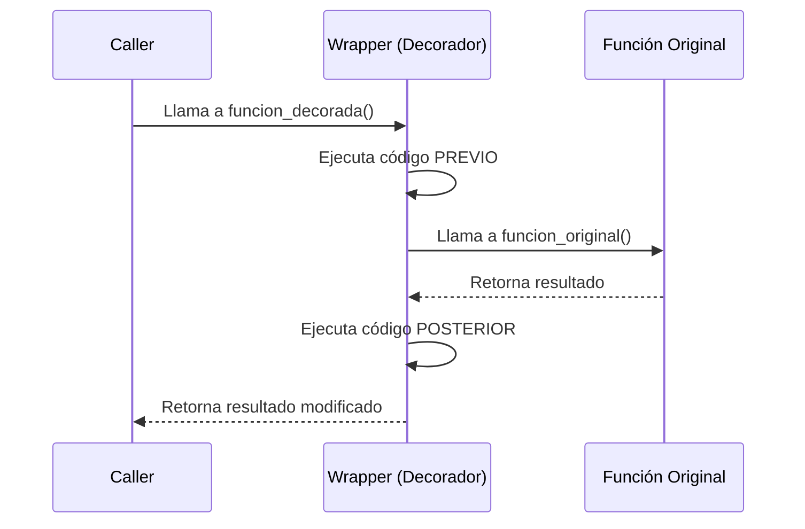

# Decoradores y Generadores: Control Avanzado

## 1. Decoradores
Patrón estructural que permite añadir funcionalidades a un objeto (función/clase) sin modificar su estructura.
- **Sintaxis**: `@decorador` encima de la función.
- **Qué son**: Funciones que reciben una función y devuelven otra función (wrapper).
- **Uso**: Logging, Timing, Autenticación, Caching (memoization).

> **Importante**: Siempre usa `functools.wraps` dentro de tu decorador para no perder el nombre y docstring de la función original.

## 2. Generadores (`yield`)
Funciones que mantienen su estado entre ejecuciones. En lugar de retornar un valor y morir, "ceden" (`yield`) un valor y pausan su ejecución hasta ser llamadas de nuevo.

### Ventajas vs Listas
1. **Memoria**: No construyen toda la lista en RAM. Generan valores bajo demanda (Lazy Evaluation).
2. **Rendimiento**: Ideales para streams de datos infinitos o muy grandes.

### Expresiones Generadoras
Similar a las list comprehensions pero con paréntesis `()`.
`gen = (x*2 for x in lista)`

## 3. Diagrama: Flujo de un Decorador

