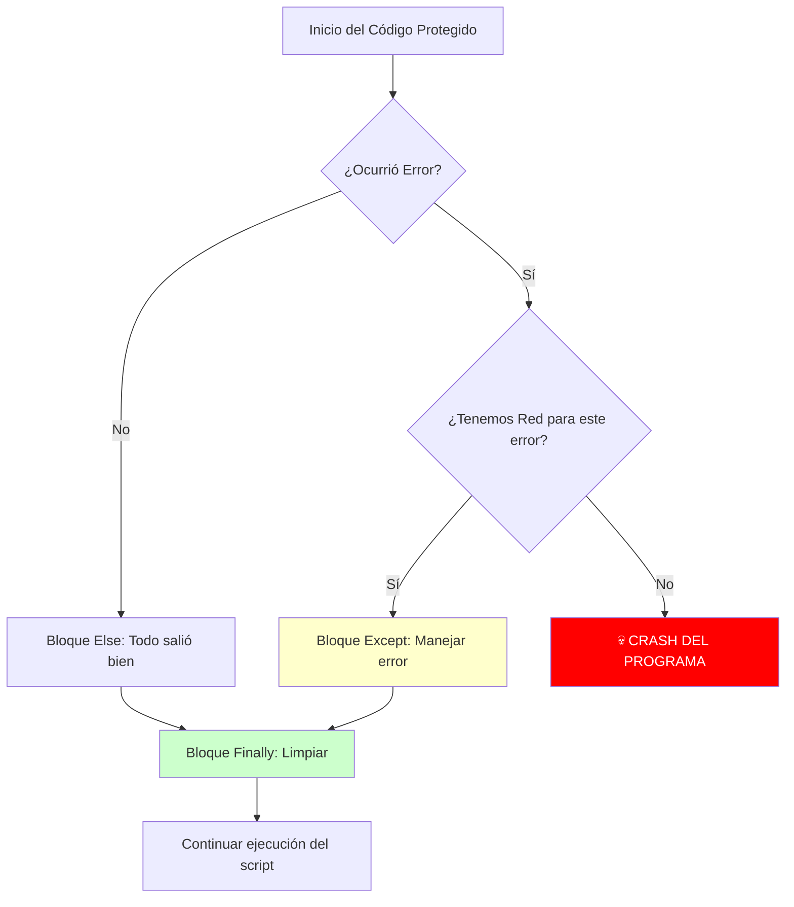

# 🥅 Manejo de Errores: La Red de Seguridad


## 👶 1. Explicación para Niños (ELI5)

Programar es como ser un trapecista en el circo 🎪.
A veces, fallas el salto (divides por cero, archivo no encontrado).
- **Sin `try/except`**: Caes al suelo, la música para, el público grita y el show termina (Crash del programa). 💀
- **Con `try/except`**: Caes en una red elástica. Rebotas, te ríes, y el show continúa. 😅

---

## 🔬 2. Deep Dive: La Jerarquía de Excepciones

En Python, todos los errores son Clases que heredan de `BaseException`.
Cuando usas `except Exception`, atrapas casi todo.
Cuando usas `except BaseException`, atrapas incluso cuando el usuario intenta cerrar el programa con Ctrl+C (KeyboardInterrupt). **¡Cuidado!**

---

## 📊 3. Visualización: El Flujo de Caída



---

## 👩‍💻 4. Tutorial Interactivo: La Billetera Segura

Vamos a crear una simulación bancaria que lanza sus propios errores personalizados.

```python
# 1. DEFINIMOS NUESTRA PROPIA EXCEPCIÓN
class DineroInsuficienteError(Exception):
    """Excepción personalizada para cuando eres pobre 💸"""
    def __init__(self, faltante, saldo_actual):
        self.faltante = faltante
        self.saldo_actual = saldo_actual
        # Llamamos al constructor padre para poner el mensaje por defecto
        super().__init__(f"No te alcanza. Te faltan ${faltante}")

# 2. CLASE CON LÓGICA DE NEGOCIO
class Billetera:
    def __init__(self, saldo):
        self.saldo = saldo

    def comprar(self, precio):
        print(f"🛒 Intentando comprar item de ${precio}...")
        if precio > self.saldo:
            # LANZAMOS EL ERROR MANUALMENTE
            raise DineroInsuficienteError(precio - self.saldo, self.saldo)
        
        self.saldo -= precio
        print("✅ ¡Compra exitosa!")

# 3. ZONA DE PRUEBAS (El Trapecio)
mi_billetera = Billetera(100)

casos = [50, 200] # Una compra posible, otra imposible

for precio in casos:
    print(f"\n--- Transacción de ${precio} ---")
    try:
        mi_billetera.comprar(precio)
    
    except DineroInsuficienteError as e:
        # Aquí atrapamos nuestro error específico y podemos leer sus datos extra
        print(f"🥅 RED ACTIVADA: {e}")
        print(f"   >> Tip: Tienes ${e.saldo_actual}, busca un trabajo.")
        
    except Exception as e:
        print(f"💥 Error genérico: {e}")
        
    finally:
        print("🧹 (Limpiando terminal post-transacción)")
```

### 🧠 ¿Qué aprendimos?
1.  **`raise`**: Nosotros controlamos cuándo falla el programa. No esperamos a que Python falle solo.
2.  **Excepciones Custom**: Al crear `DineroInsuficienteError`, podemos guardar datos útiles (como cuánto dinero falta) dentro del error para usarlos en el `except`.
3.  **`finally`**: Útil para cerrar archivos o desconectar bases de datos, ocurra o no ocurra error.

---
[⬅️ Anterior: Regalos](../04_Decoradores_Generadores/04_guia_deco_gen.md) | [Subir de Nivel: Python Avanzado 🚀](../../02_Python_Avanzado/README.md)
