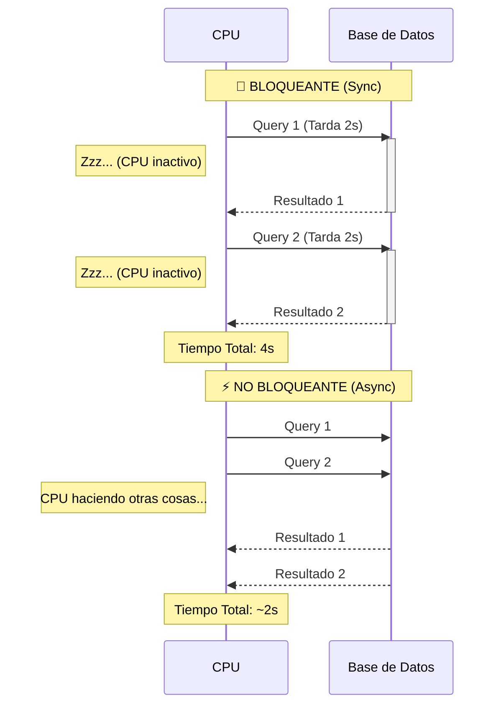

# ⏳ Asincronismo: El Chef Multitarea


## 👶 1. Explicación para Niños (ELI5)

Imagina una cocina. 👨‍🍳
- **Síncrono (Normal)**: Pones agua a hervir (tarda 10 min) y te quedas mirando la olla sin hacer nada hasta que hierva. Luego cortas la cebolla. 🐢
- **Asíncrono (`asyncio`)**: Pones el agua, y **mientras hierve**, cortas la cebolla, lavas los platos y bailas. Cuando el agua pita, vuelves a la olla. ⚡

---

## 🔬 2. Deep Dive: Cooperative Multitasking

### El Mito: "Asyncio es más rápido"
Asyncio **NO** ejecuta código más rápido. De hecho, es un poco más lento por el overhead de gestión.
Asyncio es más **EFICIENTE** esperando.
- En un servidor web, el 90% del tiempo es esperar a la Base de Datos.
- Asyncio permite que el CPU atienda otras peticiones en ese tiempo muerto.

### El Event Loop
Es un bucle infinito `while True:` que revisa una lista de tareas (`Tasks`).
Si una tarea dice `await`, el Loop la pausa y ejecuta la siguiente tarea en la lista.

---

## 📊 3. Visualización: Blocking vs Non-Blocking



---

## 👩‍💻 4. Tutorial Interactivo: Simulando Latencia

Vamos a simular 3 descargas de archivos que tardan 1 segundo cada una.

```python
import asyncio
import time

# 1. DEFINIR TAREA ASÍNCRONA
async def descargar_archivo(nombre):
    print(f"📥 Iniciando descarga de: {nombre}")
    # await asyncio.sleep(1) simula espera de I/O (Red/Disco) sin bloquear el CPU
    # NO USAR time.sleep() AQUÍ, eso bloquearía todo el programa
    await asyncio.sleep(1) 
    print(f"✅ Descarga completa: {nombre}")
    return f"Contenido de {nombre}"

# 2. ORQUESTADOR (La función main)
async def main():
    print("--- 🐢 Versión Secuencial (Mal uso de async) ---")
    start = time.perf_counter()
    # Si usamos await uno por uno, no ganamos nada
    await descargar_archivo("Foto1.jpg")
    await descargar_archivo("Foto2.jpg")
    end = time.perf_counter()
    print(f"Tiempo Secuencial: {end - start:.2f} s")

    print("\n--- ⚡ Versión Concurrente (Gather) ---")
    start = time.perf_counter()
    # asyncio.gather lanza todos a la vez al Event Loop
    resultados = await asyncio.gather(
        descargar_archivo("Video1.mp4"),
        descargar_archivo("Video2.mp4"),
        descargar_archivo("Video3.mp4")
    )
    end = time.perf_counter()
    print(f"Tiempo Concurrente: {end - start:.2f} s")
    print(f"Resultados: {resultados}")

if __name__ == "__main__":
    # Arrancamos el Event Loop
    asyncio.run(main())
```

### 🧠 ¿Qué aprendimos?
1.  **`asyncio.run()`**: El punto de entrada "mágico" que crea el Event Loop.
2.  **Concurrency vs Parallelism**: Aquí no usamos múltiples núcleos (Parallelism). Usamos un solo núcleo inteligentemente (Concurrency).
3.  **Resultados**: La versión concurrente tarda ~1s en total, sin importar si descargamos 3 o 50 archivos (suponiendo ancho de banda infinito).

---
[⬅️ Volver a Pits](../README.md) | [Siguiente: Limpieza 🧹](../02_Gestion_Memoria/02_guia_memoria.md)
