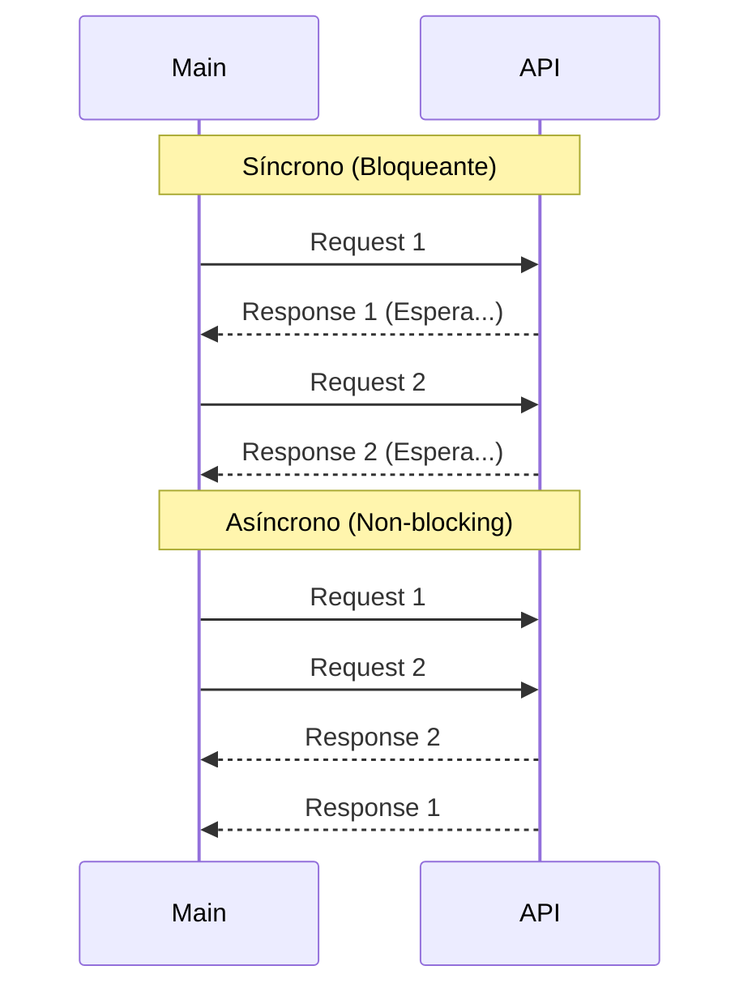

# Programación Asíncrona (Asyncio)

## 1. Concurrencia vs Paralelismo
- **Concurrencia (Asyncio/Threading)**: Tareas que avanzan "a la vez" alternando tiempos de espera (I/O bound). Ideal para redes, APIs, BDs.
- **Paralelismo (Multiprocessing)**: Tareas corriendo literalmente al mismo tiempo en múltiples núcleos (CPU bound). Ideal para cálculos pesados.

## 2. Conceptos Clave
1.  **Event Loop**: El corazón de asyncio. Gestiona y distribuye la ejecución de tareas.
2.  **Corrutina (`async def`)**: Una función que puede pausarse (`await`) y retomarse.
3.  **Awaitable**: Objetos que pueden ser esperados (Corrutinas, Tasks, Futures).

## 3. Patrones Comunes
- `await func()`: Espera secuencial.
- `asyncio.gather(func1(), func2())`: Ejecución concurrente.
- `asyncio.create_task()`: Lanza una tarea en "segundo plano" (fire and forget o esperar después).

> **GIL (Global Interpreter Lock)**: Python estándar (CPython) solo ejecuta un hilo a la vez. Por eso `threading` no acelera tareas de CPU, pero asyncio sí acelera tareas de I/O al no bloquear mientras espera respuestas externas.

## 4. Diagrama: Bloqueante vs No-Bloqueante

