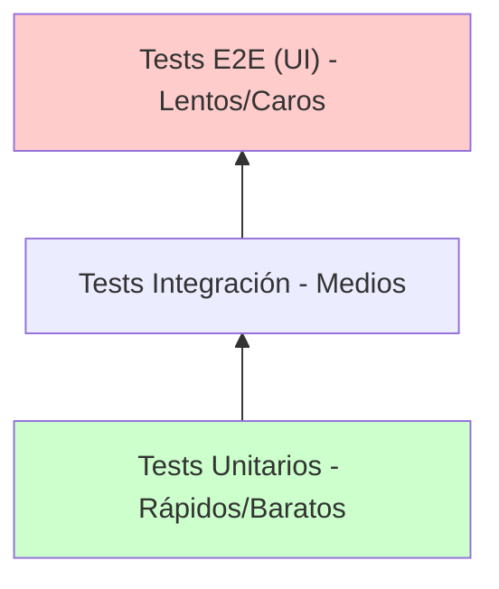

# 🕵️‍♂️ Testing: El Inspector de Calidad


## 👶 1. Explicación para Niños (ELI5)

Imagina que construyes un robot. 🤖
Antes de venderlo, tienes que probar si funciona.
- **Manual**: Lo enciendes y ves si camina. (Lento y aburrido).
- **Automático (`pytest`)**: Contratas a un ejército de mini-robots inspectores que revisan cada tornillo en 1 segundo.

---

## 🔬 2. Deep Dive: AAA Pattern

Todos los tests profesionales siguen el patrón **Arrange-Act-Assert**.
1.  **Arrange (Preparar)**: Creas los objetos, las bases de datos falsas, etc.
2.  **Act (Actuar)**: Ejecutas la función que quieres probar.
3.  **Assert (Afirmar)**: Comparas el resultado real con el esperado.

---

## 📊 3. Visualización: La Pirámide de Tests


*Deberías tener MUCHOS unitarios y POCOS E2E.*

---

## 👩‍💻 4. Tutorial Interactivo: Pytest Fixtures

Imagina que necesitamos probar una calculadora que empieza con batería baja.

```python
import pytest

# COPIAR ESTO EN UN ARCHIVO 'test_calculadora.py' y correr 'pytest'

# 1. CÓDIGO REAL A PROBAR
class Calculadora:
    def __init__(self, bateria=100):
        self.bateria = bateria
    
    def sumar(self, a, b):
        if self.bateria <= 0:
            raise RuntimeError("Batería muerta 🪫")
        self.bateria -= 1 # Gasta energía
        return a + b

# 2. FIXTURE (PREPARACIÓN AUTOMÁTICA)
@pytest.fixture
def calc_baja_bateria():
    """Crea una calculadora con solo 1 de batería."""
    print("\n🔋 [Setup] Creando calculadora débil...")
    return Calculadora(bateria=1)

# 3. TESTS
def test_suma_normal(calc_baja_bateria): # Inyectamos el fixture
    # Act
    res = calc_baja_bateria.sumar(2, 2)
    # Assert
    assert res == 4
    assert calc_baja_bateria.bateria == 0 # Debería quedar vacía

def test_muerte_bateria(calc_baja_bateria):
    # Gastamos la única carga
    calc_baja_bateria.sumar(1, 1)
    
    # Verificamos que lance error la segunda vez
    with pytest.raises(RuntimeError):
        calc_baja_bateria.sumar(5, 5)
```

### 🧠 ¿Qué aprendimos?
1.  **Fixtures**: `calc_baja_bateria` es una función, pero `pytest` la ejecuta antes del test y le pasa el *valor de retorno* al argumento del test.
2.  **Inyección de Dependencias**: El test no sabe cómo se crea la calculadora, solo la recibe lista para usar.
3.  **Tests Negativos**: Usamos `pytest.raises` para confirmar que el programa falla cuando DEBE fallar.

---
[⬅️ Volver a la Fábrica](../README.md) | [Siguiente: Laboratorio 🧪](../02_Entornos_Paquetes/02_guia_entornos.md)
