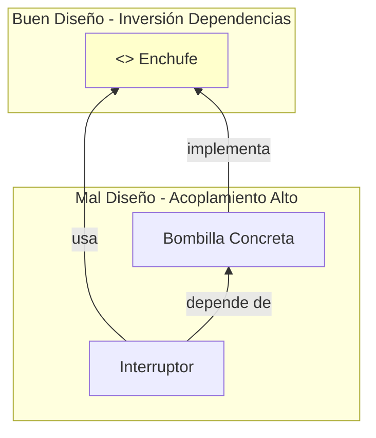

# 🧱 Clean Code: Construyendo con LEGOs


## 👶 1. Explicación para Niños (ELI5)

El código "Sucio" funciona, pero da miedo tocarlo (como un cuarto desordenado).
El código "Limpio" es como un set de LEGOs organizado. Puedes cambiar piezas sin romper todo el castillo.

---

## 🔬 2. Deep Dive: Acoplamiento y Cohesión

El objetivo de la Ingeniería de Software es:
- **Alta Cohesión**: El código relacionado debe estar junto. (La clase `Panadero` debe tener métodos de hornear, no de reparar coches).
- **Bajo Acoplamiento**: Las piezas deben depender lo menos posible entre sí. Si cambio el motor del auto, no debería tener que cambiar las llantas.

---

## 📊 3. Visualización: Inversión de Dependencias (D de SOLID)


*El Interruptor no debería conocer la Bombilla. Ambos deben conocer el Enchufe.*

---

## 👩‍💻 4. Tutorial Interactivo: Refactorizando

Vamos a arreglar un código sucio.

```python
from abc import ABC, abstractmethod

# --- ❌ CÓDIGO SUCIO (Acoplado) ---
class MotorGasolina:
    def encender(self):
        print("Brum brum! ⛽")

class Auto:
    def __init__(self):
        # ERROR: El Auto crea su propio motor. 
        # Si queremos poner un motor eléctrico, tenemos que romper la clase Auto.
        self.motor = MotorGasolina() 
    
    def arrancar(self):
        self.motor.encender()

# --- ✅ CÓDIGO LIMPIO (SOLID) ---

# 1. Definimos la Interfaz (El Contrato)
class Motor(ABC):
    @abstractmethod
    def encender(self): pass

# 2. Implementaciones Concretas
class MotorGasolinaV2(Motor):
    def encender(self): print("Brum brum! ⛽")

class MotorElectrico(Motor):
    def encender(self): print("Shhh... ⚡")

# 3. Inyección de Dependencias
class AutoMejorado:
    # El auto NO crea el motor. Lo RECIBE.
    def __init__(self, motor: Motor):
        self.motor = motor # Polimorfismo
    
    def arrancar(self):
        self.motor.encender()

# USO
nissan = AutoMejorado(MotorGasolinaV2())
tesla = AutoMejorado(MotorElectrico())

nissan.arrancar()
tesla.arrancar() # ¡Funciona sin tocar el código del Auto!
```

### 🧠 ¿Qué aprendimos?
1.  **Dependency Injection**: Pasamos el motor por el constructor `__init__`.
2.  **Open/Closed Principle**: El código de `AutoMejorado` está CERRADO a modificaciones (no hay que tocarlo) pero ABIERTO a extensión (acepta motores nucleares, de hamster, etc).

---
[⬅️ Anterior: Laboratorio](../02_Entornos_Paquetes/02_guia_entornos.md) | [Siguiente: Contenedores 🚢](../04_Docker_CI/04_guia_docker.md)
