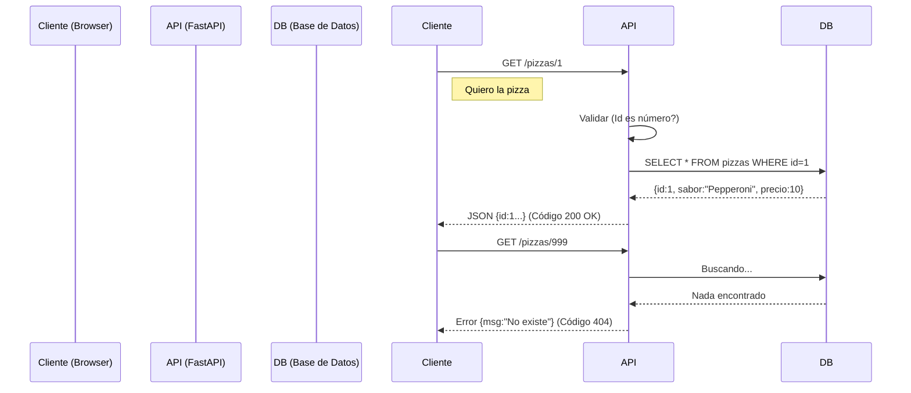

# 🌍 Web Development: La Pizzería API


## 👶 1. Explicación para Niños (ELI5)

Una **API** es como un camarero en una pizzería. 🍕
1.  Tú (Cliente) miras el menú y pides una "Pizza de Pepperoni" (**Request**).
2.  El camarero anota el pedido, va a la cocina, y cocina.
3.  El camarero vuelve y te trae la pizza en una caja (**Response**).

Si pides una "Pizza de Neumático", el camarero te dice "Eso no existe" (Error 404).

---

## 🔬 2. Deep Dive: HTTP y REST

La web habla un idioma llamado **HTTP**. Tiene verbos:
- **GET**: Dame información. (Ver menú).
- **POST**: Crea algo nuevo. (Pedir pizza).
- **PUT**: Actualiza algo entero. (Cambiar pedido).
- **DELETE**: Borra algo. (Cancelar pedido).

**FastAPI** usa **Pydantic** para validar los datos automáticamente. Si mandas un precio "gratis" en vez de `10.5` (número), Pydantic lo rechaza.

---

## 📊 3. Visualización: El Ciclo de Vida del Request



---

## 👩‍💻 4. Tutorial Interactivo: Construyendo la API

Necesitas instalar: `pip install fastapi uvicorn`

```python
from fastapi import FastAPI, HTTPException
from pydantic import BaseModel

app = FastAPI()

# 1. MODELO DE DATOS (La Caja de la Pizza)
class Pizza(BaseModel):
    nombre: str
    ingredientes: list[str]
    precio: float
    es_picante: bool = False # Opcional, por defecto False

# 2. BASE DE DATOS FALSA (En memoria)
menu = {
    1: {"nombre": "Margarita", "precio": 10.0, "ingredientes": ["Queso", "Tomate"]},
    2: {"nombre": "Pepperoni", "precio": 12.5, "ingredientes": ["Queso", "Pepperoni"]}
}

# 3. ENDPOINTS (Los Platos)

@app.get("/")
def home():
    return {"mensaje": "🍕 Bienvenido a Python Pizza!"}

@app.get("/pizzas/{pizza_id}")
def obtener_pizza(pizza_id: int): # Validación automática: pizza_id DEBE ser int
    if pizza_id not in menu:
        raise HTTPException(status_code=404, detail="Pizza no encontrada 😥")
    return menu[pizza_id]

@app.post("/pizzas/")
def crear_pizza(nueva_pizza: Pizza):
    # Pydantic ya validó que nueva_pizza tenga nombre, precio, etc.
    nuevo_id = len(menu) + 1
    menu[nuevo_id] = nueva_pizza.dict()
    return {"id": nuevo_id, "pizza": nueva_pizza}

# PARA CORRER: uvicorn nombre_archivo:app --reload
```

### 🧠 ¿Qué aprendimos?
1.  **Type Hints al rescate**: Al poner `pizza_id: int`, FastAPI convierte automáticamente el texto de la URL a número y valida error si mandas texto.
2.  **Autodocumentación**: FastAPI genera una web automática en `/docs` donde puedes probar tu API. ¡Magia!

---
[⬅️ Anterior: Contenedores](../04_Docker_CI/04_guia_docker.md) | [Siguiente: Ciencia de Datos 📊](../02_Data_Science/02_guia_data.md)
