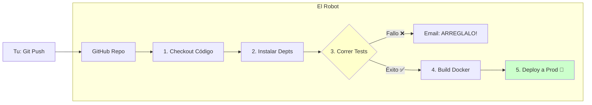

# 🤖 DevOps: El Robot Mayordomo


## 👶 1. Explicación para Niños (ELI5)

Hiciste tu código y funciona en tu compu. ✅
¿Ahora qué? ¿Vas a copiar y pegar archivos al servidor cada vez que cambies una coma? ¡No! 😫
DevOps es crear un **Robot Butler** (GitHub Actions).
Tú solo guardas el código (`git push`).
El robot se despierta, corre los tests, construye el Docker, y lo sube a la nube. Mientras, tú tomas café. ☕

---

## 🔬 2. Deep Dive: CI/CD Pipeline

- **CI (Continuous Integration)**: Integrar código frecuentemente. El robot verifica que no rompiste nada nuevo (Tests).
- **CD (Continuous Delivery/Deployment)**: Entregar el paquete listo para producción automáticamente.

El objetivo: **Reducir el tiempo desde "Tengo una idea" hasta "El usuario lo está usando"**.

---

## 📊 3. Visualización: La Tubería Automatizada



---

## 👩‍💻 4. Tutorial Interactivo: Tu Primer Workflow

GitHub busca instrucciones en la carpeta `.github/workflows`.

```yaml
# ARCHIVO: .github/workflows/main.yml
name: Python CI

# 1. ¿CUÁNDO SE ACTIVA EL ROBOT?
on:
  push:
    branches: [ "main" ] # Solo cuando subo a main
  pull_request:
    branches: [ "main" ]

# 2. ¿QUÉ HACE? (JOBS)
jobs:
  build-and-test:
    runs-on: ubuntu-latest # El robot usa Linux

    steps:
    # A. Bajar tu código
    - uses: actions/checkout@v3

    # B. Preparar Python
    - name: Set up Python 3.10
      uses: actions/setup-python@v3
      with:
        python-version: "3.10"

    # C. Instalar dependencias
    - name: Install dependencies
      run: |
        python -m pip install --upgrade pip
        pip install pytest flake8

    # D. Linting (Revisar estilo)
    - name: Lint with flake8
      run: |
        # detener si hay errores de sintaxis o variables no usadas
        flake8 . --count --select=E9,F63,F7,F82 --show-source --statistics

    # E. Testing (Revisar funcionalidad)
    - name: Test with pytest
      run: |
        pytest
```

### 🧠 ¿Qué aprendimos?
1.  **YAML**: Es el lenguaje de configuración. Indentación importa (como en Python).
2.  **Steps**: Pasos lógicos. Si uno falla (ej. Tests en rojo), el pipeline se detiene y no sigue al Deploy.
3.  **Cloud Runners**: GitHub te presta computadoras gratis (por unos minutos) para correr esto. No usas tu CPU.

---
[⬅️ Anterior: Ciencia de Datos](../02_Data_Science/02_guia_data.md) | [🏠 Volver al Inicio](../../README.md)
